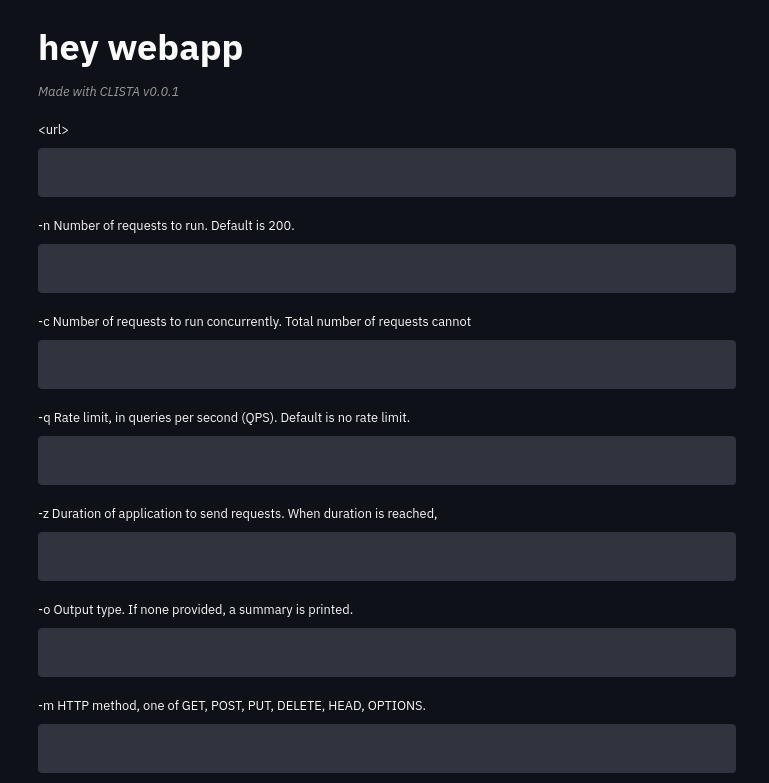
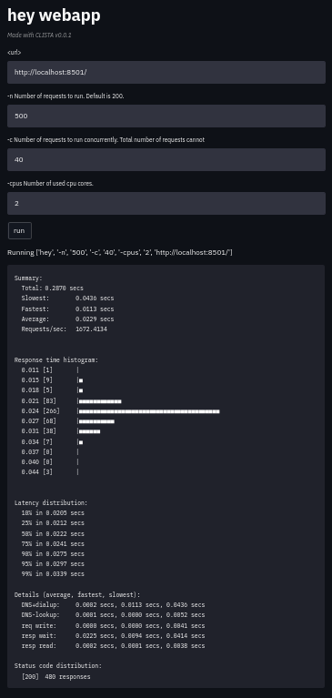

# clista - CLI to STreamlit App
Create interactive web app from any CLI with streamlit

## Status
Very early alpha version, tested only with `hey`.

## Install

```
pip install clista
```

## Why
There are different ways to do task "benchmark a website"

- Type the command to run it then copy the output and write to the report.
- Write a script to run the command 10 times then copy the output and write to the report.
- Learn Jupyter and run the command from there, export the notebook as Playbook and use as report.
- Write a webapp to run the command and display the result (take 2 months, and 5 people).
- Write a streamlit app and let who give the task run themselves, as they need.

## Use-cases
- Build one-time-used internal tool
- Build internal tool
- Build amazing tool (TODO later on this)

## Usage
### Example with hey
[`hey`](https://github.com/rakyll/hey) is a CLI HTTP load generator, like
`apache bench`.

```sh
$ hey 2>&1 | clista
Wrote stapp.py, please copy and edit as needed then run streamlit run stapp.py
NOTE: rerun would overwrite stapp.py

$ streamlit run stapp.py

  You can now view your Streamlit app in your browser.

  Local URL: http://localhost:8501
  Network URL: http://192.168.100.4:8501
```



Open `stapp.py`, removes undesired options and run to bench itself:


